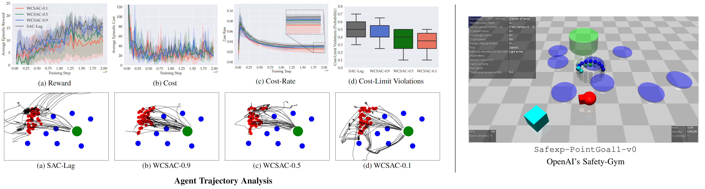

# Worst-Case Soft Actor-Critic (WCSAC) for Safety-Constrained Reinforcement Learning: A PyTorch Implementation

This is a PyTorch implementation of Worst-Case Soft Actor-Critic (WCSAC) [[Page]](https://ojs.aaai.org/index.php/AAAI/article/view/17272) [[PDF]](https://www.st.ewi.tudelft.nl/mtjspaan/pub/Yang21aaai.pdf). You can find the official TensorFlow implementation of WCSAC [here](https://github.com/AlgTUDelft/WCSAC). 

This repository is built around [PyTorch SAC](https://github.com/denisyarats/pytorch_sac) by Denis Yarats and Ilya Kostrikov. 


## Results on `Safexp-PointGoal1-v0`

<div align="center">

</div>

## Requirements
We assume you have access to a GPU that can run `CUDA 11.2`. We also assume that you have Safety-Gym ([GitHub](https://github.com/openai/safety-gym), [Blog](https://openai.com/blog/safety-gym/)) and Mujoco-Py 2.0.2.7 installed. 
```
conda env create -f conda_env.yml
source activate pytorch_wcsac
```
<sub>Note: Please do not raise any issues for problems related to Safety-Gym or Mujoco-Py installation.</sup>

## Instructions
To train a WCSAC-0.1 agent on the `Safexp-PointGoal1-v0` environment from Safety-Gym run:
```
python train.py env=point_goal_1 risk_level=0.1 seed=123
```
This will produce `exp` folder, where all the outputs are going to be stored including train/eval logs, tensorboard blobs, and evaluation episode videos. One can attach tensorboard to monitor training by running:
```
tensorboard --logdir exp
```
Also, see `config/agent/wcsac.yaml` for full list of hyperparameters. Note that `env` should have this format: `{Robot}_{Goal}_{Level-of-Difficulty}`. 

# Acknowledgement

This repository was built as part of the final project of our master's deep learning laboratory course. We sincerely appreciate the authors of the WCSAC paper, whose original implementation and answers to issues we raised played an important role in meeting our goals. 

If you use this code in your research project please cite us and the original authors as:
```
@misc{pytorch_wcsac,
  author = {Pfrang, Luca and Chandra, Akshay L and Koribille, Sri Harsha},
  title = {Worst-Case Soft Actor-Critic (WCSAC) for Safety-Constrained Reinforcement Learning: A PyTorch Implementation},
  year = {2022},
  publisher = {GitHub},
  journal = {GitHub repository},
  howpublished = {\url{https://github.com/acl21/wcsac}},
}

@article{Yang_Simão_Tindemans_Spaan_2021,
  author={Yang, Qisong and Simão, Thiago D. and Tindemans, Simon H and Spaan, Matthijs T. J.},
  title={WCSAC: Worst-Case Soft Actor Critic for Safety-Constrained Reinforcement Learning},
  year={2021},
  journal={Proceedings of the AAAI Conference on Artificial Intelligence}, 
  volume={35},
  url={https://ojs.aaai.org/index.php/AAAI/article/view/17272}
}
```
